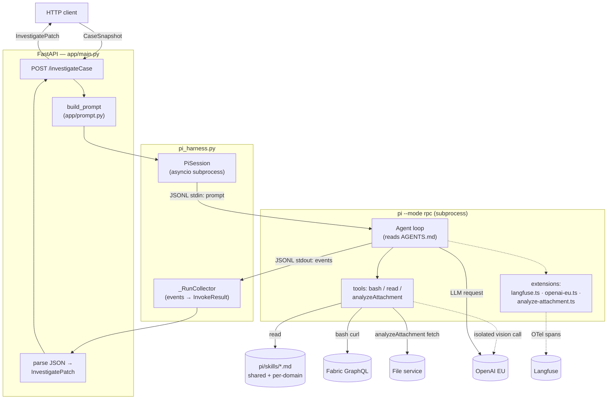

# pi-agent-harness

A small FastAPI service that wraps the [pi](https://pi.dev) coding agent and
exposes it as a REST endpoint for **case investigation**. Given a case
snapshot, the agent reads the activity history, queries a GraphQL data
source if needed, and returns a structured proposal (reply to the customer
or close the case).

## Architecture at a glance

The request flows top-to-bottom; side dependencies (skills, GraphQL,
LLM, Langfuse) hang off the agent on the right.



## Entry point

`app/main.py` defines the FastAPI app. There is one real endpoint:

- `POST /investigateCase` — takes a `CaseSnapshot`, returns an
  `InvestigatePatch` (see `app/schema/`).
- `GET /health` — liveness check.

## How FastAPI calls the agent

1. The endpoint builds a prompt from the snapshot (`app/prompt.py`). The
   user message is just the snapshot as JSON; all standing instructions
   live in `AGENTS.md`, which pi auto-discovers and merges into its system
   prompt.
2. It picks which skills to expose: the shared `graphql` and
   `response-format` skills, plus a per-domain skill folder if one exists
   for the case's `system.domain` (`pi/skills/domains/<domain>/`). These
   are passed to pi as `--skill <path>` args.
3. It calls `run_pi(...)` from `pi_harness.py`, which:
   - Spawns `pi --mode rpc --no-session ...` as an asyncio subprocess.
   - Writes a single `{"type":"prompt", ...}` JSONL command to its stdin.
   - Reads JSONL events from stdout until `agent_end`.
   - Returns an `InvokeResult` with the final assistant text, tool calls,
     usage, and duration.
4. The endpoint strips any code fences from the final text and parses it
   into an `InvestigatePatch`. If parsing fails, it returns HTTP 502 with
   the raw output so callers can debug.

The pi agent itself runs `bash` (for `curl` to GraphQL) and `read` (for
loading skill files) as tools. It is instructed to produce a single JSON
object as its final assistant message — no prose, no fences.

## Tools

| Tool                | Kind     | What it does |
| ------------------- | -------- | ------------ |
| `bash`              | built-in | Shell. Used for `curl` against Fabric GraphQL (auth + queries documented in the `graphql` skill). |
| `read`              | built-in | Load a skill file's body. Skills are listed in `<available_skills>`; the agent reads on demand. |
| `analyzeAttachment` | typed (custom extension) | Fetch case attachments (images) from the file service and extract structured data via an **isolated** vision sub-call. Raw bytes never enter the main agent's context. |

`analyzeAttachment` is registered via `pi.registerTool({...})` in
`pi/extensions/analyze-attachment.ts` with TypeBox-validated inputs
(`attachments[]` of `{filename, domain, storage_type, content_type?}` +
optional `instruction`). Its `execute()` GETs each file from
`${FILE_SERVICE_BASE_URL}/{domain}/files/{storage_type}/{filename}`, sends
the bytes to OpenAI with a strict `json_schema` response format
(`{dataPoints: {label, value}[], interpretation}`), and returns the
parsed summary as `content` plus structured `details` for traces. PDFs
are not yet supported (returns a per-file error analysis); images only.
The tool disables itself cleanly if `FILE_SERVICE_BASE_URL` or
`OPENAI_API_KEY` is unset.

## How observability works

Tracing is implemented as a **pi extension**, not as code in the Python
layer. `pi/extensions/langfuse.ts` registers handlers for pi's lifecycle
events and maps them onto Langfuse OTel observations:

| pi event                  | Langfuse observation        |
| ------------------------- | --------------------------- |
| `session_start`           | `pi-session` span (root)    |
| `before_agent_start`      | `agent` observation         |
| `turn_start` / `turn_end` | `turn` chain                |
| `before_provider_request` | `llm-call` generation       |
| `message_end` (assistant) | fills generation output/usage |
| `tool_execution_start/end`| `tool` observation          |
| `agent_end`               | sets agent/session output   |
| `session_shutdown`        | flushes OTel SDK            |

Tool names are rewritten to read as **intent** rather than mechanism:
`bash` becomes `bash:graphql` or `bash:fabric-auth` based on the command,
and `read` of a skill file becomes `read:<skill-name>`. So a trace tree
shows what the agent was *doing*, not just which tool it called.

A second small extension, `pi/extensions/openai-eu.ts`, registers the EU
OpenAI endpoint as the `openai` provider so requests stay in-region.

A third extension, `pi/extensions/analyze-attachment.ts`, registers the
typed `analyzeAttachment` tool (see [Tools](#tools)).

## Layout

```
app/
  main.py            FastAPI app + /investigateCase
  prompt.py          Snapshot → user message
  schema/            Pydantic models (CaseSnapshot, InvestigatePatch)
pi_harness.py        asyncio wrapper around `pi --mode rpc`
AGENTS.md            System prompt for the agent (auto-loaded by pi)
pi/
  settings.json      pi defaults (model, provider, thinking level)
  skills/            Markdown skill files (shared + per-domain)
  extensions/        TypeScript pi extensions (langfuse, openai-eu,
                     analyze-attachment)
Dockerfile           Python + Node + pi CLI + extensions
docker-compose.yml   Bind-mounts repo into /workspace, exposes :6006
Makefile             build / up / down / sh / logs
```

## Running

```bash
cp .env.example .env   # fill in OpenAI, Langfuse, Fabric creds,
                       # and FILE_SERVICE_BASE_URL for analyzeAttachment
make build
make up
curl -s localhost:6006/health
```

Then POST a `CaseSnapshot` to `localhost:6006/investigateCase`.
